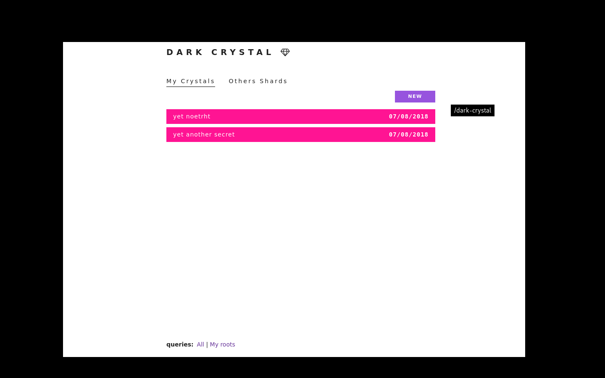

# Patchbay-dark-crystal

A [Dark Crystal](https://github.com/blockades/scuttle-dark-crystal) module for [Patchbay](https://github.com/ssbc/patchbay).

To use, install and run Patchbay ([multi-platform installers here](https://github.com/ssbc/patchbay/releases)) and enter `/dark-crystal` in the navigation input box on the top-right. 

